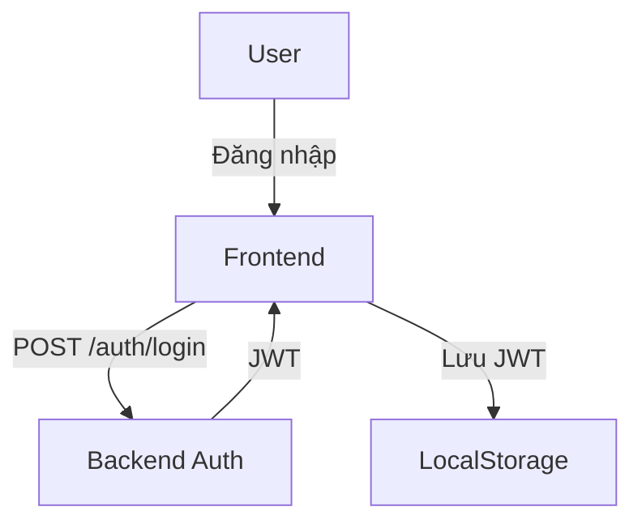
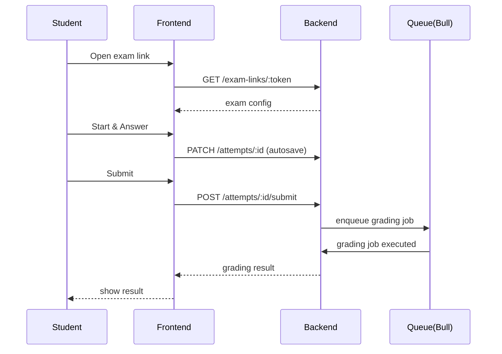

# Tổng Quan Chức Năng & Luồng Người Dùng

## Mục đích
Tài liệu này mô tả tổng quan chức năng chính của ứng dụng "Academic Trust Suite" và các luồng người dùng (user flows) chính cho các vai trò: Student, Instructor, Admin.

---

## Tổng quan chức năng chính
- **Xác thực & quản lý người dùng**: đăng ký, đăng nhập (JWT), quên mật khẩu, phân quyền (student/instructor/admin).
- **Quản lý khóa học**: tạo/cập nhật khóa học, học kỳ (term), đăng ký học (enrollment).
- **Quản lý đề thi**: tạo đề thi, cấu hình thời gian, kiểu thi (NORMAL/LAB), đặt điều kiện truy cập.
- **Exam Links**: tạo liên kết truy cập thi (một lần hoặc giới hạn), gửi link cho thí sinh.
- **Thực hiện thi**: giao diện thi trực tuyến, đồng hồ đếm ngược, auto-save, chấm điểm tự động/một phần.
- **Ngân hàng câu hỏi (Question Bank)**: quản lý câu hỏi, phiên bản (v2), trạng thái lifecycle (DRAFT, IN_REVIEW, PUBLISHED, ARCHIVED).
- **Tự động hoá & AI**: hỗ trợ sinh câu hỏi/gợi ý bằng AI (Google Generative AI hoặc Ollama local).
- **Hàng đợi & tác vụ nền**: sử dụng Bull + Redis cho việc gửi email, tạo báo cáo, backfill dữ liệu.
- **Thông báo & realtime**: push notification, popup, thông báo hệ thống.
- **Email & OTP**: gửi thông báo, kết quả, link phục hồi mật khẩu.
- **Báo cáo & Analytics**: thống kê điểm, độ khó câu hỏi, phân tích kết quả.
- **Quản trị hệ thống**: migrate/seed DB, quản lý migration, Prisma Studio.

---

## Personas (Vai trò người dùng)
- **Student**: Tham gia khóa học, nhận exam link, làm bài thi, xem kết quả và lịch sử nộp bài.
- **Instructor**: Tạo khóa học, tạo đề thi, quản lý ngân hàng câu hỏi, chấm điểm và phát hành kết quả.
- **Admin**: Quản lý người dùng, cấu hình hệ thống, xem báo cáo toàn hệ thống, thực thi migration/seed khi cần.

---

## Luồng người dùng chính (User Flows)

### 1) Đăng ký / Đăng nhập (Student/Instructor/Admin)
1. Người dùng mở trang `Đăng ký` hoặc `Đăng nhập`.
2. Khi đăng ký: điền thông tin -> server hash password bằng `bcrypt` -> tạo user record.
3. Khi đăng nhập: server xác thực -> trả `JWT` với `expiresIn` (15m) -> client lưu token.
4. Client gọi API có header Authorization: `Bearer <token>`.

Mermaid:

### 2) Học viên ghi danh vào khóa học
1. Student vào trang Course -> chọn `Enroll`.
2. Frontend gọi API: `POST /courses/:id/enroll`.
3. Backend kiểm tra quyền, tạo record `enrollment`.
4. Student nhận thông báo/confirmation.

### 3) Tạo và công bố đề thi (Instructor)
1. Instructor vào `Create Exam` -> cấu hình (thời gian, mode, allowed links, randomize questions).
2. Instructor chọn câu hỏi từ Question Bank hoặc sinh câu hỏi bằng AI.
3. Lưu draft -> review -> publish.
4. Khi publish, hệ thống có thể tạo exam links và gửi email.

### 4) Thí sinh truy cập Exam qua Exam Link và làm bài
1. Thí sinh nhận `exam link` (URL) hoặc mã.
2. Mở link -> server kiểm tra hợp lệ (thời gian, số lượt, whitelist).
3. Nếu hợp lệ, tạo `attempt` mới và trả cấu hình exam.
4. Giao diện thi hiển thị câu hỏi, timer, auto-save (every N seconds) -> lưu progress qua API `PATCH /attempts/:id`.
5. Thí sinh hoàn thành -> nhấn `Submit` -> server lưu final submission, push job vào Bull queue để chấm tự động/notify.
6. Sau khi chấm xong, kết quả được cập nhật và thông báo cho thí sinh.

Mermaid (Take Exam):

### 5) Instructor chấm tay & phát hành điểm
1. Instructor mở danh sách submissions -> xem từng submission.
2. Chấm tay (override điểm tự động), lưu thay đổi.
3. Khi hoàn tất, `publish results` -> students nhận email/notification.

### 6) Quản trị hệ thống / Admin tasks
- Quản trị viên có thể seed/migrate DB, xem logs, reset môi trường QA.
- Thực thi scripts: `backfill-question-v2`, `seed`, `prisma:migrate`.

---

## Hướng dẫn nhanh cho developer (how-to)
- Chạy dev frontend: `npm run dev` (port 8080)
- Chạy dev backend: `npm run start:dev` trong `backend/`
- Khởi dựng toàn bộ bằng Docker: `docker-compose up --build`
- Prisma migrations: `npm run prisma:migrate` (backend)

---

## Ghi chú
- Tài liệu này là tóm tắt chức năng chính; chi tiết từng API/DTO/Entity xem trong `backend/src/` và `prisma/schema.prisma`.
- Nếu cần, tôi có thể thêm các flow chi tiết cho các tính năng phụ (ví dụ: autosave recovery, audit logs, RBAC flows).

---

*File được tạo tự động ngày 4 May 2026.*
